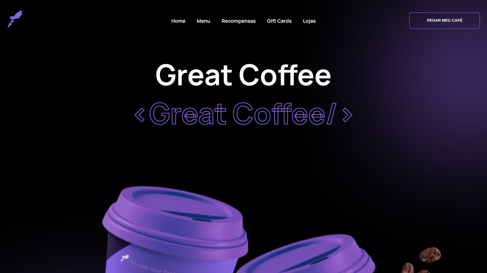
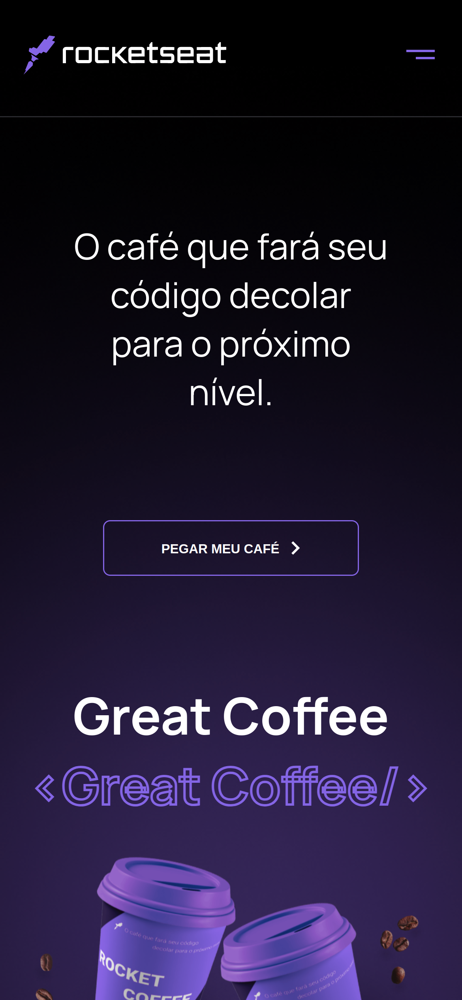

# Rocketseat - Rocketcoffee

O desafio consiste em desenvolver uma homepage para uma marca de café.

## Table of contents

- [Overview](#overview)
  - [The challenge](#the-challenge)
  - [Screenshot](#screenshot)
  - [Links](#links)
- [My process](#my-process)
  - [Built with](#built-with)
  - [What I learned](#what-i-learned)
  - [Useful resources](#useful-resources)
- [Author](#author)

## Overview

### O Desafio

Esse desafio aborda diversos conceitos como: HTML Semântico, CSS (Positions, FlexBox,...), DOM.

---

### Screenshot

---

### Links

- Live Site URL: [Rocketcoffee](https://matheus-lincon.github.io/rocket-coffee)

## My process

### Built with

- Semantic HTML5 markup
- JavaScript
- CSS
  - Flexbox
  - Position absolute & relative
- Mobile-first workflow

### What I learned

Nesse desafio consegui praticar mais sobre layout responsivo e outras maneiras de trabalhar com menus.

---

## Author

- LinkedIn - [matheus.lincon.10010](https://www.linkedin.com/in/matheus-lincon-10010/)
- GitHub - [@matheus-lincon](https://www.github.com/matheus-lincon)

---
